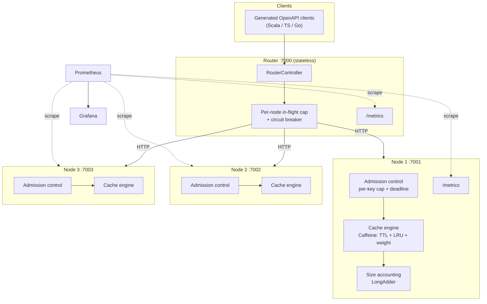

# Part 3 — Technical Roadmap: From KV Store to Cache

Design only. Nothing here is implemented.

The brief asks for "a simple diagram and short notes." This document is deliberately longer than that
because it is *preparation* for the 10–15 minute roadmap discussion, not the script for it. See
[The ten-minute version](#the-ten-minute-version) for what actually gets presented; everything else is
depth to have ready for questions.

---

## The thesis

Parts 1 and 2 built a **correct** key-value store. Per-key atomicity holds, versions are monotonic,
the counter test lands on exactly 300, and the keyspace scales horizontally. What it is not is
**operable**. Five things would stop it from being deployed:

| Gap | Failure mode today |
|---|---|
| No hot-key protection | One popular key saturates one node's thread pool and takes down *all* keys on that node |
| Unbounded memory | The map grows until the JVM dies; 1/N of the keyspace vanishes with it |
| No eviction | Nothing ever leaves. Memory is a monotonic function of traffic history |
| No observability | Zero signal. Contention, skew, and capacity pressure are all invisible until an outage |
| No stable client contract | Errors are free-text strings; every consumer hand-rolls HTTP and parses JSON by hand |

The single decision that makes all five tractable is **reframing the service from a store to a cache**.

A store must never lose a write, so every one of these problems has an expensive answer: capacity
pressure means you shard or spill to disk, membership changes mean data migration, hot keys mean you
cannot replicate because replicas would diverge. A cache is allowed to forget. Once forgetting is
permitted:

- **Capacity** becomes a policy question (what do we evict?) instead of an infrastructure question.
- **Hot keys** can be replicated, because bounded staleness is acceptable.
- **Resharding** becomes a cold-start — a hit-ratio dip and a load spike — rather than a data migration.

That reframing is the roadmap. Everything below is a consequence of it.

**The cost, stated plainly:** the `ifVersion` guard currently means "no lost updates, ever." In a cache
it means "no lost updates, as long as the entry is still resident." That is a real weakening of the
Part 1 contract and it is discussed in full under
[The semantic cost of eviction](#the-semantic-cost-of-eviction). It is the most important tradeoff
in this document.

---

## Target architecture



Nothing in the request path changes shape. The router still hashes and forwards; the node still owns
its slice of the keyspace. What is added is a gate in front of the store, a policy engine inside it,
and a scrape endpoint beside it.

---

## Workstream 1 — Hot-key protection

### The problem

`InMemoryKvStore.mutate` calls `ConcurrentHashMap.compute`, which holds the bin lock for the duration
of the remapping function. That is exactly what gives Part 1 its per-key atomicity, and it is also the
hot-key failure mode: **every concurrent request for one key blocks a thread inside `compute`.**

The lambda itself is short — a JSON shallow merge — so per-key throughput stays high. The problem is
that the queue in front of it is unbounded. A thousand concurrent writers to `user:42` park a thousand
threads. Play's default execution context is a bounded fork-join pool, so those threads are not
available to serve `user:43`, and a single hot key becomes a **whole-node outage**.

Two amplifiers make it worse than it first looks:

1. **Partitioning does not help.** `ModuloPartitioner` sends one key to exactly one node. Adding nodes
   increases aggregate capacity but does nothing for the hot key. Horizontal scale is the wrong lever.
2. **The router shares a connection pool.** `RemoteNodeClient` uses one `WSClient` for all nodes with a
   5 s timeout. Requests queued against the slow node exhaust the shared AsyncHttpClient pool, so a hot
   key on node-2 degrades traffic to node-1 and node-3 as well. The blast radius escapes the node.

### The design: bound the queue, not the work

The critical realisation is that **you cannot time out work that is already inside `compute`.** There is
no interruption point; the lambda must run to completion or the map is left inconsistent. So the deadline
has to be enforced *before* entry, on the wait for admission. This is a feature, not a workaround — it
means the timeout is enforced at exactly one place, and the uncancellable region is provably short.

```
request → [admission: acquire per-key permit, bounded wait] → [compute: short, uncancellable] → response
                        │
                        └── timeout or cap exceeded → 429 + Retry-After
```

A small `KeyAdmissionControl` sits in front of the store:

```scala
// sketch — not implemented
class KeyAdmissionControl(maxPerKey: Int, maxWait: FiniteDuration) {
  private val permits = new ConcurrentHashMap[String, Semaphore]()

  def withPermit[A](key: String)(op: => A): Either[Rejected, A] = ...
}
```

**The bookkeeping trap:** a `ConcurrentHashMap` keyed by user-supplied strings is a second unbounded
structure — precisely the problem Workstream 2 exists to fix. Two ways out:

| Approach | Pros | Cons |
|---|---|---|
| **Exact per-key semaphore**, removed via `compute` when the permit count returns to full | Precise; no false rejections; reuses the same atomic-removal idiom already in the store | Removal must be atomic with the last release or the entry leaks; a little fiddly |
| **Striped counters**, fixed array of `AtomicInteger` indexed by `hash(key) % 4096` | Bounded by construction, zero bookkeeping, cannot leak | Unrelated keys share a stripe, so a cap can trigger for the wrong reason |

**Recommendation: exact per-key with removal-on-zero.** The atomic removal is the same `compute`-based
reasoning the store already relies on, so it is familiar ground rather than a new hazard, and false
rejections on a load-shedding path are genuinely confusing to debug. Striping is the fallback if the
removal proves flaky under test.

### Timeouts, layered

| Layer | Setting | Purpose |
|---|---|---|
| Admission wait | `kv.hotkey.maxWait = 50ms` | Bounds queueing in front of `compute`. The real defence |
| Node request | `play.server.akka.requestTimeout` | Backstop only. Already 10 s for the chunked listing endpoint |
| Router → node | `kv.remoteTimeout` (currently 5 s) | Should drop to ~200 ms for point operations; 5 s is a listing-endpoint number applied to everything |
| Per-node in-flight cap | new, e.g. 256 | Stops one slow node from draining the shared WS pool |
| Circuit breaker | Akka `CircuitBreaker` (already on the classpath via Play 2.8 / Akka 2.6) | Fail fast on a node that is consistently timing out, instead of queueing against it |

**Enforce node-side first.** The node is the only place that is authoritative — a peer-forwarding
topology, or a client that talks to a node directly, both bypass the router. Router-side rejection is a
cheap optimisation that saves a hop; it is not the control.

### Response contract

A new status code, distinct from the existing ones, with a stable machine-readable reason:

```
429 Too Many Requests
Retry-After: 1
{ "code": "KEY_OVERLOADED", "error": "too many concurrent operations on key", "key": "user:42" }
```

Kept separate from `409` (version conflict — retry immediately with a fresh read) and `503` (node down —
retry elsewhere or later). A client that cannot tell these apart will retry the wrong way and make the
overload worse, which is the argument for the error envelope in Workstream 5.

### What the cache framing unlocks later

Once bounded staleness is acceptable, hot **reads** get a much better answer than shedding: mirror the
top-K hottest keys into a small router-side cache with a sub-second TTL. A hot read then never reaches
the owning node at all. This is impossible for a store — the mirror would serve stale versions and break
the `ifVersion` contract — and unremarkable for a cache. Worth raising in discussion as the payoff of the
reframing, but it depends on the hot-key detector from Workstream 4, so it sequences after everything else.

Hot **writes** have no such escape: they are inherently serial on one key. Shedding is the honest answer.

### To-dos

- [ ] `KeyAdmissionControl` with per-key permit, bounded wait, removal-on-zero
- [ ] Wire into `KvController` (node-side, authoritative) ahead of every store call
- [ ] `429` + `Retry-After` response path with a stable error code
- [ ] Split `kv.remoteTimeout` into point-operation and streaming timeouts
- [ ] Per-node in-flight cap and Akka `CircuitBreaker` in `RemoteNodeClient`
- [ ] Load test: single hot key at high concurrency; assert *other* keys hold their latency SLO

---

## Workstream 2 — Bounded memory

### The problem

`ConcurrentHashMap[String, VersionedValue]` with `JsValue` payloads grows without limit. The JVM dies,
and because Part 2 has no replication, 1/N of the keyspace dies with it. Worse, the death is preceded by
a long GC-thrash window where the node is technically alive and still accepting traffic — so the router
keeps forwarding to it. Slow death is worse than fast death here.

### Two modes, one ceiling

Both modes have a memory ceiling. What differs is **what happens when you reach it** — and that
difference *is* the store/cache distinction, made concrete in one config key:

```hocon
kv.memory {
  mode         = bounded      # bounded | unbounded
  maxBytes     = 512m         # explicit ceiling; wins if set
  heapFraction = 0.6          # else derived from Runtime.maxMemory
  overheadFactor = 3.0        # serialized-bytes → heap-bytes multiplier (see below)
}
```

| Mode | At the ceiling | Semantics | Use when |
|---|---|---|---|
| `bounded` | **Reject the write** — `507 Insufficient Storage` | Store: nothing resident is ever lost | The data has no other home |
| `unbounded` | **Evict** the least valuable entry | Cache: availability over completeness | There is an origin to re-read from |

Naming the mode after the *logical* keyspace (unbounded = you may write as many keys as you like) rather
than the physical memory is deliberate — the physical ceiling exists in both.

### Measuring memory, honestly

This is the genuinely hard part and the easiest place to hand-wave.

| Option | Verdict |
|---|---|
| **JOL** (Java Object Layout) — accurate deep sizing | Rejected for the hot path. Needs `-Djdk.attach.allowAttachSelf`, and it is far too slow per write |
| **Serialized length × factor** — `Json.stringify(value).length` at write time | **Recommended.** One serialization per write, deterministic, easy to reason about |
| **`MemoryMXBean` feedback loop** — calibrate the factor from post-GC heap | Over-engineered for v1, but the metric that would drive it is free (Workstream 4) |

```
entryBytes ≈ 48 (entry overhead) + key.length * 2 + serializedLength * overheadFactor
```

The factor matters because a `JsObject` tree is *much* heavier on the heap than its serialized form —
every `JsString` is an object header plus a `String` plus a `char[]`. Empirically that is a 2–5×
multiplier, so it is config-tunable with a default of 3.

**Be explicit that this is an estimate, not a measurement.** The mitigation is to export both the
estimate and actual heap usage as metrics, so the factor can be tuned from a Grafana panel instead of
guessed once. Workstreams 2 and 4 are coupled for this reason, and it is why metrics sequence first.

### Where the size lives

An internal entry wrapper, not a change to `VersionedValue`:

```scala
// internal to the store — VersionedValue stays the API model
private case class Entry(vv: VersionedValue, sizeBytes: Int, lastAccessNanos: Long, expiresAtNanos: Long)
```

`VersionedValue` is serialized straight into HTTP responses by `KvController`, so widening it would leak
cache internals into the public API. Keeping the wrapper internal means the controllers and the JSON
shape are untouched — the whole change stays behind the existing `KvStore` trait.

The running total is a `LongAdder`, updated **inside the same `compute` lambda** that mutates the map. It
has to be inside: updating it after `compute` returns would let a concurrent write interleave and drift
the total. `LongAdder` rather than `AtomicLong` because this is a high-contention write-mostly counter
read rarely — its exact use case.

### Cluster-level capacity

Capacity is per node, and **even key distribution is not even byte distribution.** Murmur spreads keys
uniformly, but one 4 MB value on node-2 outweighs ten thousand small ones. The node that fills first is
whichever drew the fattest values, and nothing rebalances it.

Mitigation is visibility rather than cleverness: `GET /internal/stats` per node, aggregated by the router
into `GET /stats`, with a byte-skew gauge in Grafana. Actually fixing skew means value-aware placement,
which breaks the "hash the key" contract that makes routing stateless — not worth it. Rejecting a small
number of oversized values (`kv.maxValueBytes`) gets most of the benefit for none of the complexity.

### To-dos

- [ ] Internal `Entry` wrapper carrying `sizeBytes`
- [ ] Size estimator + `overheadFactor` config, with a test comparing it against JOL (test-scope only)
- [ ] `LongAdder` total maintained inside the `compute` lambda
- [ ] Ceiling from `maxBytes` or `heapFraction`; `507` + stable error code on rejection
- [ ] `kv.maxValueBytes` guard on single oversized values
- [ ] `GET /internal/stats` and router-side `GET /stats` aggregation

---

## Workstream 3 — TTL and LRU eviction

This is the workstream that actually turns the store into a cache.

### TTL

Per-entry expiry, set by `?ttl=60s` on PUT/PATCH or defaulted by `kv.eviction.defaultTtl`. Two
enforcement points, and both are needed:

- **Lazy, on read.** `get` treats an expired entry as absent and removes it. Free, but reclaims nothing
  for a key that is written once and never read — which is exactly the key you most want reclaimed.
- **Active sweeper.** A scheduled task (`system.scheduler`) samples a bounded slice per tick rather than
  scanning: take ~20 random keys, expire what is dead, and if more than 25% were dead, immediately
  sample again. This is Redis's approach. Its virtue is that the work per tick is bounded regardless of
  keyspace size, so there is no scan-induced latency spike — important given a large heap on JDK 11 / G1.

Two interactions worth pre-deciding, because they will come up:

1. **Expiry is deletion, so version resets to 1 on recreation.** A client holding version 7 that retries
   `ifVersion=7` after expiry gets a `409`. That is *correct* — the guard fired, no lost update — but the
   reason differs from a genuine conflict, and a client that distinguishes them behaves better.
2. **`GET /kv` must filter expired-but-unswept keys** out of the NDJSON stream. Otherwise the listing
   advertises keys that immediately `404`, which is a confusing contract for anything iterating it.

### LRU

`ConcurrentHashMap` has no ordering, so eviction needs something extra.

| Option | Assessment |
|---|---|
| **`LinkedHashMap(accessOrder = true)` + global lock** | True LRU, and **rejected outright.** A global lock destroys the per-key concurrency that Part 1's entire design exists to provide. Trading the core property for an eviction policy is backwards |
| **Caffeine** (`com.github.ben-manes.caffeine`) | **Recommended.** W-TinyLFU admission, near-optimal hit ratio, lock-free access recording via ring buffers, and `maximumWeight` + `Weigher` + `expireAfter*` + `evictionListener` built in |
| **Sampled LRU** (Redis `allkeys-lru`) | Keep `lastAccessNanos` per entry; on eviction sample K keys and drop the oldest. No dependency, 8 bytes/entry, O(K) per eviction. The fallback if the Caffeine migration is judged too invasive |

**The feasibility check that decides this:** does Caffeine preserve per-key atomicity? Yes —
`cache.asMap().compute(...)` gives the same contract as `ConcurrentHashMap.compute`: the function is
applied atomically and concurrent updates to that key block. The entire Part 1 correctness argument
survives the swap unchanged. If that were not true, the migration would be off the table, so it is worth
stating explicitly rather than assuming.

Caffeine also collapses Workstream 2's ceiling into the same component: `maximumWeight` with a `Weigher`
returning the estimated entry size gives byte-bounded capacity for free, and `evictionListener` is the
metrics hook.

Two more details:

- **Reads now mutate state.** Recording an access is a ring-buffer append in Caffeine, not a lock, so read
  concurrency is preserved. Under a hand-rolled implementation it would serialise reads — which is the
  quiet reason the naive LRU is so much worse than it looks.
- **Migration path:** keep `InMemoryKvStore`, add `CaffeineKvStore` behind the existing `KvStore` trait,
  select by config, and run the full existing suite (including `CounterSpec`) against both. This is the
  payoff for having defined the trait in Part 1 — the riskiest change in the roadmap lands behind an
  interface that already exists, and the old implementation stays as a fallback.
- **Version compatibility:** Caffeine 3.x requires JDK 11 — fine here. Caffeine 2.9.3 if the target ever
  drops to JDK 8.

### The semantic cost of eviction

**This is the most important tradeoff in the roadmap and should be volunteered, not waited for.**

An evicted key loses its version. A client doing read-modify-write with `ifVersion` across an eviction
boundary gets a `409` and retries against a fresh version 1. There is still no lost update and no torn
read — the guard does its job — but the counter *went backwards*. The `counter_increment.sh` scenario,
run against a cache under memory pressure, could legitimately finish below 300.

Part 1's contract was: *the current version is durable*. A cache cannot promise that. Concretely:

| Client pattern | Safe under eviction? |
|---|---|
| Read-modify-write with `ifVersion` retry | Yes — but the value may restart from scratch |
| `ifVersion` as a mutual-exclusion / lease primitive | **No.** Eviction silently releases the lease |
| Read-through cache of an authoritative origin | Yes — this is the intended pattern |

Three mitigations, in increasing cost:

1. **Document it and offer `mode = bounded, policy = none`** for workloads that need store semantics.
   The config switch means one deployment does not force the other's tradeoff. Cheapest and probably
   sufficient.
2. **A pin / no-evict flag per key** for a small set of entries that must not disappear.
3. **Exclude keys with recent `ifVersion` traffic from eviction** — an in-flight read-modify-write is
   evidence someone is mid-transaction. Elegant, but it makes eviction depend on request history, which
   is a lot of machinery for a narrow case.

### To-dos

- [ ] `expiresAt` on the internal entry; `?ttl=` parameter; `kv.eviction.defaultTtl`
- [ ] Lazy expiry on read + sampling sweeper with bounded per-tick work
- [ ] Filter expired entries out of the `/internal/keys` NDJSON stream
- [ ] `CaffeineKvStore` behind `KvStore`, config-selected, with `Weigher` and `evictionListener`
- [ ] Run the full existing suite — `InMemoryKvStoreSpec`, `KvControllerSpec`, `CounterSpec`,
      `RouterIntegrationSpec` — against both implementations
- [ ] Document the eviction/versioning interaction in the README and the OpenAPI spec
- [ ] Soak test: steady write load above the ceiling, assert stable memory and no OOM over hours

---

## Workstream 4 — Observability

**Sequenced first**, ahead of everything above. Every other workstream requires a number that does not
currently exist: what should the per-key cap be? what is the real heap-to-serialized ratio? what hit
ratio does the TTL produce? Choosing those blind is guessing, and metrics is also the smallest item.

### Implementation

Prometheus `simpleclient` (0.16.0 — the last of the 0.x line, and stable) written from a plain Play action.
No Play-specific plugin is needed:

```scala
def metrics = Action {
  val w = new StringWriter()
  TextFormat.write004(w, registry.metricFamilySamples())
  Ok(w.toString).as(TextFormat.CONTENT_TYPE_004)
}
```

`CollectorRegistry` as a Guice singleton in `Module`, `DefaultExports.initialize()` for JVM metrics,
exposed on both roles.

### The metric catalogue

The catalogue is the deliverable here — the plumbing is an afternoon.

**RED, on the API surface**

- `kv_requests_total{role, method, outcome}` — outcome ∈ `ok | not_found | conflict | rejected | unavailable | bad_request`
- `kv_request_duration_seconds` — histogram, buckets from 0.5 ms (this is an in-memory map; default
  Prometheus buckets start far too coarse to see anything)

**Contention** — this is the one that makes Part 1's design visible

- `kv_conflicts_total` — the `409` rate *is* the contention rate. Directly measures the property the
  whole store design is about
- `kv_key_admission_rejected_total`, `kv_key_inflight` — hot-key shedding

**Capacity**

- `kv_entries`, `kv_bytes_estimated`, `kv_bytes_limit`
- `kv_evictions_total{reason = ttl | lru | capacity}`
- `kv_writes_rejected_total{reason = capacity | value_too_large}`

**Cache effectiveness**

- `kv_hits_total`, `kv_misses_total` → hit ratio. Only meaningful post-Workstream 3; before that a miss
  is just a `404`

**Cluster**

- `kv_router_forward_duration_seconds{node}`, `kv_node_unavailable_total{node}`
- `kv_keys_per_node`, `kv_bytes_per_node` → partition-skew panel

**JVM** — `simpleclient_hotspot` gives heap, GC pause, and thread counts for free. Non-optional for this
project: with a large in-memory heap on JDK 11 / G1, GC pause is the dominant hidden latency source, and
it is exactly the thread the implementation plan's JDK-version discussion leaves open.

### Cardinality — the trap

**Key names must never become label values.** A key-labelled metric on a user-controlled keyspace is an
unbounded time series and it will take down Prometheus long before it takes down the cache. This
constraint is easy to state and easy to violate under pressure when debugging a hot key.

The hot-key detector goes somewhere else: a bounded top-K frequency sketch (Count-Min, or Caffeine's own
frequency sketch if it is already a dependency) exposed as `GET /internal/hotkeys`, plus periodic logging.
Aggregate counts in Prometheus, identities out of band.

### Dashboards and alerts

Three dashboards, provisioned as JSON in `ops/grafana/` so they are version-controlled rather than
hand-drawn:

1. **Service RED** — rate, errors, duration, split by role and method
2. **Cache health** — hit ratio, evictions by reason, bytes vs limit, TTL survival
3. **Cluster** — per-node latency, key and byte skew, node availability

Alerts: p99 latency breach; 5xx rate; `bytes_estimated / bytes_limit > 0.9`; eviction-rate spike (the
early warning that capacity is now the binding constraint); hit-ratio drop; node unreachable; conflict-rate
spike (a hot key emerging).

Local stack: `docker-compose` with Prometheus and Grafana alongside the existing router and three nodes.

**This is the most demoable item in the roadmap.** Run `counter_increment.sh` against the cluster and watch
the conflict-rate panel spike in real time — the lost-update contrast from Part 1, now with a graph.

### Adjacent: tracing

OpenTelemetry across the router → node hop, correlated by a `kv-request-id` header propagated in
`RemoteNodeClient`. Cheap to add and a large debugging payoff, but out of scope as a separate concern
from metrics.

### To-dos

- [ ] `CollectorRegistry` singleton, `/metrics` on both roles, `DefaultExports.initialize()`
- [ ] Instrument `KvController`, `RouterController`, and the store per the catalogue
- [ ] Top-K hot-key sketch behind `GET /internal/hotkeys` (never as Prometheus labels)
- [ ] `docker-compose` Prometheus + Grafana, dashboards as provisioned JSON
- [ ] Alert rules
- [ ] Calibrate `overheadFactor` from `kv_bytes_estimated` vs actual heap

---

## Workstream 5 — Published OpenAPI client

### The problem, which is not the one it looks like

The obvious framing is "generate SDKs so consumers stop hand-rolling HTTP." True, and
`counter_increment.sh` parsing JSON with `grep -o '"version":[^,}]*'` is the evidence.

The real prerequisite is subtler: **the error contract is not machine-readable.** Errors today are
free-text — `{"error": "version conflict"}`, `{"error": "invalid ifVersion 'abc': must be a long integer"}`.
No generated client can branch on that. And Workstreams 1–3 add three new failure modes that clients
*must* handle differently:

| Status | Meaning | Correct client behaviour |
|---|---|---|
| `409` | Version conflict | Re-read and retry immediately |
| `429` | Key overloaded | Back off, honour `Retry-After` |
| `503` | Node unavailable | Retry later or route elsewhere |
| `507` | Capacity exhausted | Do not retry; this is not transient |

Retrying a `507` like a `409` turns a capacity problem into an outage. So publishing a client forces the
error envelope to become stable and enumerable — which is the actual value, and it is a design constraint,
not a codegen exercise:

```json
{ "code": "KEY_OVERLOADED", "error": "human readable detail", "key": "user:42", "retryable": true }
```

### Spec-first, not code-first

Today `conf/swagger.yml` plus play-swagger 1.6.1 generates **Swagger 2.0** from route comments. Moving to
**OpenAPI 3.0** is a prerequisite for good codegen; the options are:

| Option | Assessment |
|---|---|
| Keep 2.0, generate with `swagger-codegen` | Works, but 2.0 cannot cleanly express what is needed (`oneOf` error bodies, response headers like `Retry-After`) |
| Convert 2.0 → 3.0 in the build | A generated artifact derived from a generated artifact. Two chances to drift |
| **Hand-maintain `openapi.yaml` as the source of truth**, verify the server against it in CI | **Recommended** |

The argument for spec-first: the spec becomes the contract, reviewed like code and published as a build
artifact. Annotation-derived specs drift, and they are poor at expressing exactly the things that matter
here — conditional-request semantics, response headers, an enumerated error taxonomy. The cost is two
places to change, and the mitigation is a contract test that fails CI when the running server disagrees
with the spec.

### Generation, publishing, versioning

- `sbt-openapi-generator` (or a pinned `openapi-generator` Docker invocation) producing `scala-sttp`,
  `typescript-fetch`, and `go` clients
- Scala client published to the internal Maven repo, TS to npm, both from CI on tag
- Spec versioned with SemVer, **decoupled from the server version** — the spec is the contract, the server
  is an implementation of it
- `openapi-diff` in CI to fail the build on a breaking change without a major bump

### Eat the dog food

The proof that the client works is using it internally:

- Replace `RemoteNodeClient`'s hand-written `ws.url(...)` calls with the generated Scala client
- Replace `counter_increment.sh`'s `grep`-based JSON parsing with a small generated-client program

Both remove hand-maintained duplication and both fail loudly if the spec is wrong. The bash script in
particular is a good demo: it is currently the most fragile artifact in the repo.

### What the spec must newly describe

- `429` + `Retry-After`, `507`, and the error-code enum
- `?ttl=` on PUT/PATCH
- `expiresAt` in the GET response
- `GET /stats`, `GET /metrics`, `GET /internal/hotkeys`
- NDJSON streaming on `GET /kv` — awkward in OpenAPI; document as
  `application/x-ndjson` with the per-line schema described in prose

### To-dos

- [ ] Stable error envelope with a `code` enum; migrate all existing error responses
- [ ] Hand-authored `openapi.yaml` (OpenAPI 3.0) as the source of truth; retire play-swagger generation
- [ ] Contract test: running server vs spec, in CI
- [ ] `openapi-diff` breaking-change gate
- [ ] Generate + publish Scala, TypeScript, Go clients from CI
- [ ] Migrate `RemoteNodeClient` and `counter_increment.sh` onto the generated client

---

## Deferred — Elastic membership

Listed because it is the most visible architectural weakness, and deferred deliberately.

**Today:** `NodeRegistry` reads a static ordered list and `ModuloPartitioner` computes `hash(key) % N`.
Adding a node changes `N`, which remaps nearly every key. Nothing is deleted, but every existing key is now
addressed at the wrong node — functionally a full flush, requiring a coordinated restart of every routing
process.

**Why the cache framing changes the calculus:** for a store, a full remap is a data-migration project with
a correctness requirement. For a cache it is a **cold start** — a hit-ratio dip and a load spike on the
origin, both of which are visible on the Workstream 4 dashboards and both of which recover on their own.
This is the clearest illustration of the thesis: *eviction semantics turn resharding from a migration into
a capacity event.*

That said, doing it properly is still the largest item here:

- **Consistent hashing** with ~150 vnodes per node, so only ~1/N of keys move rather than nearly all. The
  `Partitioner` trait already exists for exactly this — a second implementation, not a refactor
- **Dynamic membership**: config reload via `ApplicationLifecycle` + file watch (simplest), an external
  registry such as etcd/Consul, or Akka Cluster gossip (Akka 2.6 is already on the classpath)
- **Ring-version header** so a node can reject a misrouted request rather than silently serving a key it
  does not own. Without this, a split-brain ring corrupts data silently — which is much worse than an error
- **Optional dual-read** during the rebalance window to smooth the hit-ratio dip

Sequenced last: it is the biggest item, and it is meaningfully cheaper *after* the cache framing exists.

---

## Sequencing and effort

```mermaid
gantt
  dateFormat X
  axisFormat %s
  section Foundations
  Metrics + dashboards        :a, 0, 3
  section Availability
  Hot-key protection          :b, after a, 3
  section Capacity
  Memory accounting + bounded :c, after b, 4
  Cache mode - TTL + LRU      :d, after c, 6
  section Contract
  OpenAPI 3 + clients         :e, after d, 4
  section Deferred
  Elastic membership          :f, after e, 10
```



| Phase | Work | Estimate | Why here |
|---|---|---|---|
| 0 | Metrics, dashboards, alerts | 2–3 d | Smallest item; every later decision needs its numbers |
| 1 | Hot-key admission + deadlines | 2–3 d | Smallest blast radius, biggest availability win. Independent of the cache work |
| 2 | Size accounting + bounded mode | 3–4 d | Prerequisite for eviction — you cannot evict to a ceiling you cannot measure |
| 3 | TTL + LRU via Caffeine | 4–6 d | The actual store → cache pivot. Riskiest change; lands behind the existing `KvStore` trait |
| 4 | OpenAPI 3, error envelope, clients | 3–4 d | Deliberately after 1–3, so the new status codes are settled before the contract is published |
| 5 | Elastic membership | 8–10 d | Largest item; materially cheaper once eviction semantics exist |

**Phases 0–4: roughly 15–20 developer-days.** Phase 5 roughly doubles that.

Two ordering choices worth defending, because both are slightly non-obvious:

- **Metrics before everything.** It is tempting to treat observability as polish applied at the end. Here
  it is a dependency: the per-key cap, the `overheadFactor`, and the default TTL are all numbers that must
  be measured rather than guessed.
- **OpenAPI after the cache work, not before.** Publishing a client contract and then adding three new
  status codes to it means a breaking major version on day one.

---

## How we would know it worked

| Goal | Measure |
|---|---|
| A hot key degrades only itself | Single key at high concurrency; p99 on *other* keys stays within SLO |
| Memory is bounded | Sustained write load above the ceiling for hours; RSS flat, no OOM, no GC death spiral |
| Eviction is not pathological | Hit ratio above target under a realistic Zipfian access pattern |
| Capacity pressure is visible before it is fatal | Alert fires at 90% of ceiling with enough lead time to act |
| The contract is real | Generated clients round-trip every documented status code, including the new ones |

**Test approach per workstream:** a hot-key load generator (k6 or Gatling, or an extended
`counter_increment.sh`) for Workstream 1; an estimator-fidelity test against JOL in test scope for
Workstream 2; the full existing suite run against both `KvStore` implementations for Workstream 3;
a scrape-and-assert test for Workstream 4; a spec-vs-server contract test for Workstream 5.

## Risks

| Risk | Mitigation |
|---|---|
| Caffeine migration subtly breaks per-key atomicity | Run `CounterSpec` and `RouterIntegrationSpec` against both implementations; keep `InMemoryKvStore` as a config-selectable fallback |
| Size estimator is badly wrong, so the ceiling is meaningless | Export estimate *and* actual heap; tune from the dashboard; fail safe by setting the ceiling conservatively |
| Hot-key cap rejects legitimate traffic | Start with the cap in shadow mode — count rejections, do not enforce — until the metric confirms the threshold |
| Semaphore map leaks, reintroducing unbounded memory | Removal-on-zero under test; striped-counter fallback is bounded by construction |
| Eviction breaks a client relying on version durability | Ship `mode = bounded, policy = none` as the default; opt in to cache semantics explicitly |

---

## The ten-minute version

If the roadmap slot is short, this is the whole argument:

1. **One sentence:** Parts 1 and 2 are correct but not operable; the change that makes them operable is
   reframing the store as a cache.
2. **One diagram:** the [target architecture](#target-architecture) — admission control in front, cache
   engine inside, metrics beside.
3. **One number:** unbounded memory is the only gap that is *certain* to cause an outage. Everything else
   is a degradation.
4. **One tradeoff, volunteered rather than waited for:**
   [eviction weakens the `ifVersion` contract](#the-semantic-cost-of-eviction) from "no lost updates ever"
   to "no lost updates while resident."
5. **One sequencing insight:** metrics ship first, because the cap size, the memory factor, and the TTL
   are all measurements, not guesses.

The strongest single point to land: **the cache reframing is not a feature, it is what makes the other
four problems have cheap answers** — most visibly resharding, which stops being a data migration and
becomes a cold start.
